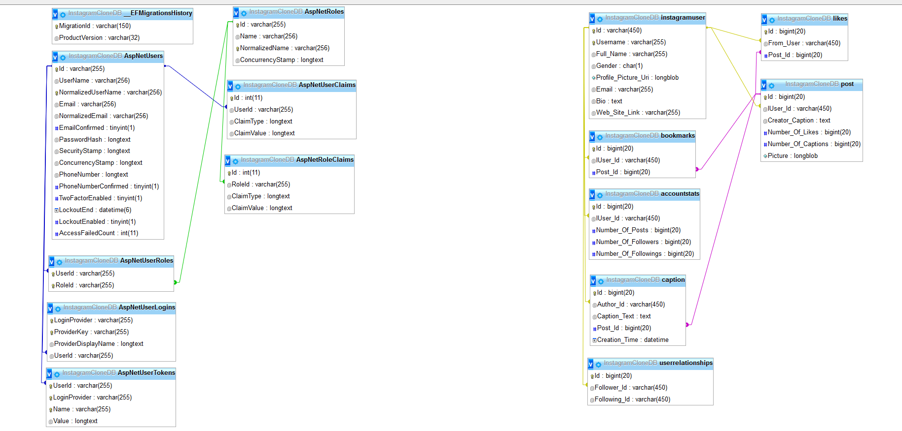

# Instagram Clone Project
##### A little bit of lyrics
The best way to learn some material - is to use it on practice. Following this principle I made a strong-willed decision to create the project on the base of ASP .NET Core framework and put it on the Internet. The only thing left to do is to decide what project I will build. It needed to be challenging and not to complex (because it's was my first experience as a "Full Stack" developer) at the same time. Finally my decision fell to the project called **Instagram Clone**. As the name suggests, the main idea here is to create the closest copy of worldwide known platform Instagram. Now, less lyrics, more specifics.
##### Database structure

At the left side you can see the tables created by Identity API, on the right side there are my tables. As you can see, I have "instagramuser" table, at the moment I created it I didn't know that to add additional properties to AspNetUser table you can basically add these properties to the class inherited from IdentityUser and then apply the migrations, so I have done it in my way. All interactions with DB performed through **Dapper Micro ORM** using the stored procedures. During the development I realized that this is not the best way of interaction with DB, and it would be better if I have just used EF, but half of the job was done, so I decided to continue in the same path. You can find all queries in [this file](DBQueries.sql).
##### Front-end 
My relationships with lady Front-end is a bit complicated and this part was the most difficult for me, because only now I have started learning Angular front-end framework, during the development process I was using only plain `.cshtml`, `.css` and `.js` files. This approach became really boring and messy in some moment. Also must point out that for now my application is not fully responsive, in the way that **it's not adapted for mobile devices**.
##### Back-end
The project type that I have chosen was **ASP .NET Core MVC**. So no revelations here, everything as usual.
##### Functionality
The project is fully functional and deployed to my [site](https://www.liveofaperson.com), so if you interested, please register and look around. However before getting to the juicy part let me explain what you can do on the site, so you don't miss a single feature:

1. **Register and Login** - Identity API provides an agile login functionality.
2. **Add Posts** - just press the button at the center of the navigation bar, corresponding modal will open.
3. **Change Profile Information** - press "change profile" button to edit or add extra information about you.
4. **Check the List of Followers and Followings** - press at the followers or followings indexes to get the list users that you follow or you are following.
5. **Add Captions, Like Post, Bookmark Post, Delete Post** - click on the post and have fun. (to see bookmarked posts, press to **SAVED** section; also you can only delete post if it belongs to you)
6. **Find Other Users and Their Posts** - press on the compass button, on the right side of the navigation bar. You will see posts of other people, you can comment them, follow the author or travel to the author profile.
##### Epilogue
As you might noticed my project is far from perfection, but don't judge me strictly, as it is my first experience developing something serious.

